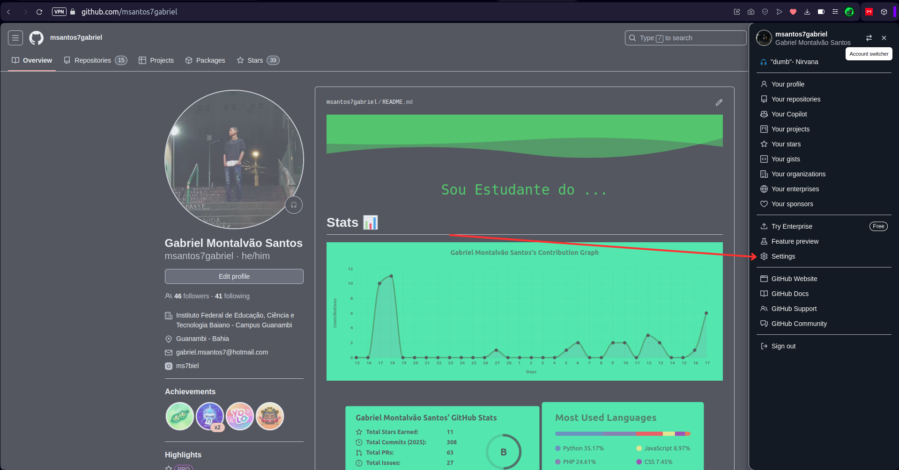
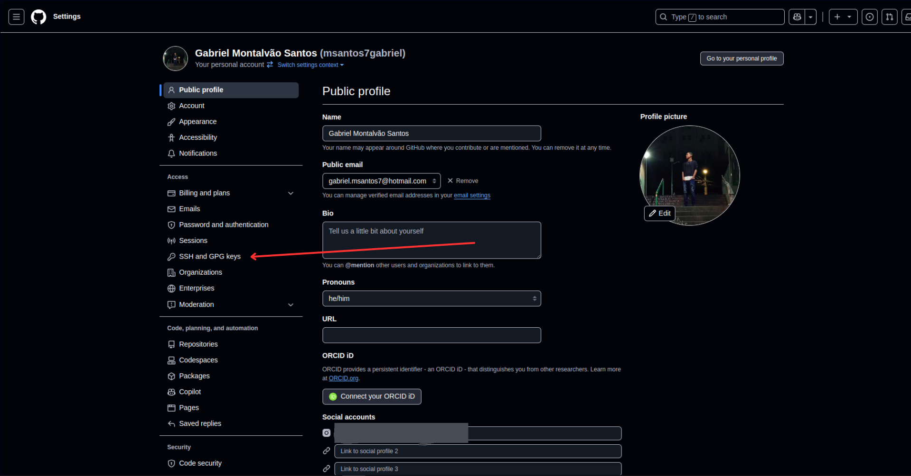

# Git Clone com SSH

> [!NOTE]
> Essa alteração não é obrigatória para resolver erros como **EOF**.

## Passo 1

Para poder forçar o git a clonar todos os repositórios com o git use o seguinte comando:

```BASH
git config --global url."git@github.com:".insteadOf "https://github.com/"
```

Esse comando vai alterar suas configurações em `~/.gitconfig`

## Passo 2

Agora é necessário criar uma chave **SSH** Valida para o GitHub

Para gerar a Chave rode:

1. Gerar Chave **SHH**:

   ```BASH
   ssh-keygen -t ed25519 -C "seu_email@exemplo.com"
   ```

   Substituindo por seu email utilizado na criação da sua conta no GitHub

1. Adicionar sua chave **SSH** ao **ssh-agent**

   ```BASH
   eval "$(ssh-agent -s)"
   ```

   em seguida, adicione sua chave recém-criada ao agente

   ```BASH
   ssh-add ~/.ssh/id_ed25519
   ```

1. Agora você deve copiar o conteúdo da sua chave pública para a área de transferência (Ctrl + C), leia o arquivo com o seguinte comando:

   ```BASH
   cat ~/.ssh/id_ed25519.pub
   ```

1. Após isso devemos adicionar a chave copiada e adicionar no nosso github

   - Acesse sua conta do GitHub.

   

   - Clique na sua foto de perfil (ou avatar) no canto superior direito e selecione Settings.

     

   - No menu à esquerda, clique em SSH and GPG keys.

   

   - Clique no botão New SSH key ou Add SSH key.
   - Dê um título (por exemplo, "Minha chave Linux") e cole a chave pública no campo indicado.
   - Clique em Add SSH key para salvar.

1. Testar a conexão:
   Para verificar se tudo está configurado corretamente, execute:
   ```BASH
   ssh -T git@github.com
   ```
   Se for a primeira vez, você poderá ver uma mensagem perguntando se deseja continuar a conexão. Digite `yes`. e deve receber uma mensagem como: `Hi Nome_De_Usuário! You've successfully authenticated, but GitHub does not provide shell access.`
