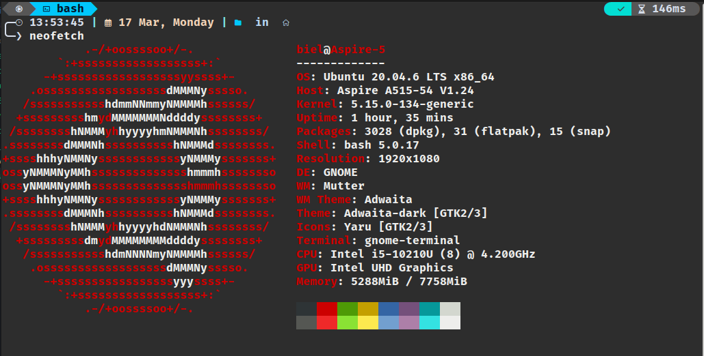

# Como saber sua versão de Ubuntu

Para saber se sua versão de ubuntu é a requestada iremos rodar o comando neofetch

```BASH
sudo apt install neofetch
neofetch
```

o comando deve retornar algo como:


veja que na primeira linha possui o atributo **OS**,
caso seja Ubuntu 20.04.0 LTS, **Prossiga o tutorial** clicando [aqui](README.md#instalar-o-ros).

Caso **não**, Clique [aqui](https://releases.ubuntu.com/focal/ubuntu-20.04.6-desktop-amd64.iso) para baixar a versão mencionada.
